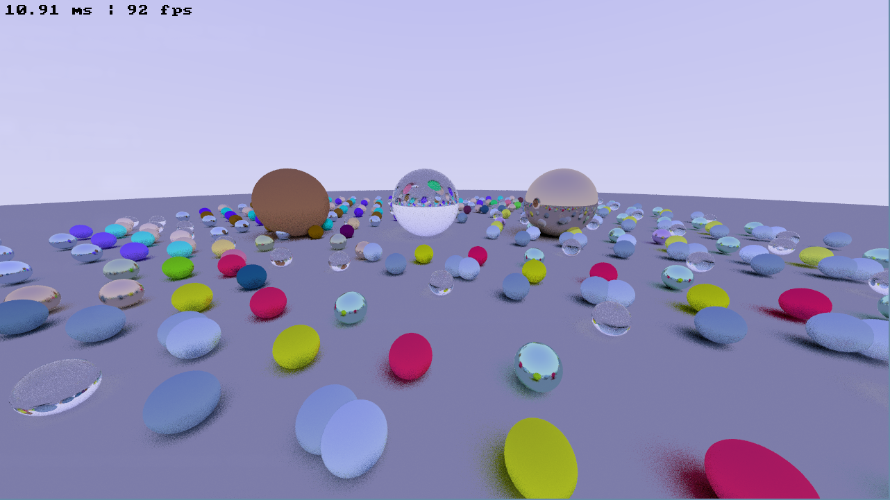

# Abhay's Path Tracer

A from-scratch **real-time GPU path tracer** written in modern C++20 and CUDA. Rays are cast, bounced, and shaded with Monte Carlo integration entirely on the GPU, accelerated by a Surface Area Heuristic (SAH) bounding volume hierarchy. The exact same rendering core also runs on the CPU as a reference path, selected by a runtime toggle. The app presents live results through SDL3 with an interactive camera, switchable scenes (from three spheres up to twenty-five thousand), and a frame-timing overlay.



---

## Table of Contents

- [Features](#features)
- [Architecture Overview](#architecture-overview)
- [Rendering Pipeline](#rendering-pipeline)
- [Materials](#materials)
- [Acceleration Structure (BVH)](#acceleration-structure-bvh)
- [Dependencies](#dependencies)
- [Building](#building)
- [Running](#running)
- [Controls](#controls)
- [Built-in Scenes](#built-in-scenes)
- [Configuration](#configuration)
- [Math & Coordinate Systems](#math--coordinate-systems)
- [Performance](#performance)
- [Development](#development)
- [Author](#author)

---

## Features

- **CUDA GPU path tracing** at 1280×720 with one thread per pixel (8×8 blocks)
- **Shared host/device core**: a single `HOSTDEV` templated renderer compiles for both GPU (CUDA) and CPU, so the CPU path is a faithful reference of the GPU path
- **Monte Carlo integration**: configurable samples-per-pixel with per-sample sub-pixel jitter for antialiasing, and a configurable maximum bounce depth
- **Three physically-inspired materials**: Lambertian diffuse, Metal (reflective with fuzz), and Dielectric (refraction with Schlick reflectance)
- **SAH bounding volume hierarchy**: binned Surface Area Heuristic build with an object-median fallback, ordered front-to-back traversal, and a brute-force path for tiny scenes
- **Structure-of-Arrays geometry**: sphere centers, radii, and material indices are stored in parallel arrays for coalesced GPU access
- **Per-pixel RNG**: cuRAND (XORWOW) state per pixel on the GPU, `std::mt19937` on the CPU
- **Sky gradient background** and **gamma-corrected** output packed to ARGB8888
- **Runtime CPU/GPU toggle** and **live scene switching**
- **Performance overlay** showing frame time and FPS
- **Profiling built in**: NVTX hooks and Nsight Systems (`nsys`) recipes for capture and reporting

---

## Architecture Overview

```
┌─────────────────────────────────────────────────────────────────┐
│                         Application Layer                        │
│  src/main.cpp     (SDL3 callbacks, input, present, CPU/GPU swap) │
│  include/appstate.hpp (window/renderer/texture + scene loading)  │
└────────────────────────────┬────────────────────────────────────┘
                             │
        ┌────────────────────┴────────────────────┐
        │                                          │
┌───────▼──────────────────┐            ┌──────────▼───────────────┐
│        GPU Layer          │            │        CPU Layer          │
│  src/gpu_render.cu        │            │  include/cpu/cpu_render.hpp│
│  src/gpu_memory.cu        │            │  (serial per-pixel loop)  │
│  src/gpu_random.cu        │            │                           │
└───────────────┬───────────┘            └──────────┬───────────────┘
               │                                    │
               └────────────────┬───────────────────┘
                                │
┌────────────────────────────▼────────────────────────────────────┐
│                      Shared Rendering Core                        │
│  render/render.hpp   (ray_color, per-pixel sampling)             │
│  render/camera.hpp   (viewport, ray generation, movement)        │
│  render/material.hpp (Lambertian / Metal / Dielectric)          │
│  geometry/bvh_tree   (SAH build + traversal)                     │
│  geometry/sphere_*   (SoA buffer + ray-sphere intersection)     │
└────────────────────────────┬────────────────────────────────────┘
                             │
┌────────────────────────────▼────────────────────────────────────┐
│                         Foundation Layer                         │
│  math/vec3, ray, aabb, interval   (vectors, slabs, ranges)      │
│  base/config      (resolution, sampling, seed, HOSTDEV macro)   │
│  base/random      (host/device RNG dispatch)                    │
│  render/color, frame_buffer, background                          │
└─────────────────────────────────────────────────────────────────┘
```

The renderer follows a classic Monte Carlo path-tracing layout, with the twist that the core is compiled twice — once for the device and once for the host — via the `HOSTDEV` macro:

1. **Load** a scene into a Structure-of-Arrays sphere buffer, material table, and BVH on the CPU.
2. **Upload** those buffers to the GPU and initialize a per-pixel RNG state.
3. **Trace** the scene each frame in `render_kernel`, one thread per pixel.
4. **Integrate** several jittered samples per pixel, bouncing each ray through the BVH until it escapes to the sky or hits the depth cap.
5. **Present** the framebuffer via an SDL streaming texture, with a live timing overlay.

---

## Rendering Pipeline

Each frame, `SDL_AppIterate()` in `src/main.cpp` dispatches to either the GPU or CPU renderer. The GPU path launches `render_kernel` (`src/gpu_render.cu`) over an 8×8 thread-block grid; the CPU path (`include/cpu/cpu_render.hpp`) walks the same pixels serially. Both call the shared `render()` in `include/shared/render/render.hpp`.

### 1. Ray Generation

For each pixel, `SAMPLE_COUNT` primary rays are generated. Each sample is jittered inside the pixel by `sample_square()` for antialiasing:

```
sample   = first_pixel + (i + jitter_x) * delta_u + (j + jitter_y) * delta_v
direction = sample - camera_center
```

The viewport basis (`delta_u`, `delta_v`, `first_pixel`) is derived from the camera position, look-at, field of view, and aspect ratio in `Camera::init_viewport()`.

### 2. Path Integration

`ray_color()` iterates up to `MAX_DEPTH` bounces, maintaining an accumulated attenuation:

1. Intersect the scene through the BVH (`tree->hit`) over the interval `[0.001, ∞)`.
2. On a miss, return the accumulated attenuation modulated by the sky gradient.
3. On a hit, scatter the ray according to the surface material.
4. Multiply the running attenuation by the material's attenuation and continue with the scattered ray.
5. If the depth cap is reached, the path contributes black (no light found).

### 3. Shading & Output

Per-pixel color is averaged over all samples, gamma-corrected (`sqrt`, clamped to `[0, 0.999]`), and packed into a 32-bit ARGB8888 `Color`.

### 4. Present

The device framebuffer is copied back to host memory, blitted into an SDL streaming texture, and rendered to the window. The overlay (`I` to toggle) reports frame time and FPS.

---

## Materials

All materials live in a tagged union (`Material`) with a `MaterialType` discriminator, so a single sphere table can mix surface types.

| Material | Type | Behavior |
|----------|------|----------|
| **Lambertian** | `MaterialType::Lambertian` | Diffuse scatter around the surface normal; `albedo` color attenuation. Degenerate directions fall back to the normal. |
| **Metal** | `MaterialType::Metal` | Mirror reflection about the normal, perturbed by a `fuzz` factor; rays that scatter below the surface are absorbed. |
| **Dielectric** | `MaterialType::Dielectric` | Refraction via Snell's law with total-internal-reflection handling; Fresnel approximated by **Schlick's reflectance** (computed with plain multiplications rather than `pow`). |

Scatter direction randomness is drawn from the shared per-pixel RNG, so the GPU and CPU paths follow identical logic.

---

## Acceleration Structure (BVH)

Ray-scene intersection is accelerated by a bounding volume hierarchy over the spheres (`include/shared/geometry/bvh_tree.hpp`).

### Node Layout

```cpp
struct BVHNode {
  AABB bbox;                 // axis-aligned bounds
  int  left_i, right_i;      // child indices (-1, -1 for a leaf)
  union { int sphere_i; int split_axis; };
};
```

The tree is a full binary tree with **one sphere per leaf**, allocated as a flat array of `2 * size - 1` nodes.

### Build — Binned SAH

For each internal node, `sah_split()` bins primitive centroids into 12 buckets along each axis, evaluates the Surface Area Heuristic cost at every bucket boundary:

```
cost = left_count * left_area + right_count * right_area
```

and partitions around the cheapest split found across all three axes. When no axis has centroid extent, or a chosen plane fails to separate the primitives, the build falls back to an **object-median split** on the widest centroid axis.

### Traversal

`BVHTree::hit()` walks the tree with an explicit stack and the ray's inverse direction for fast slab tests:

- Scenes of **16 spheres or fewer** skip the tree and use a brute-force linear scan.
- Children are visited **near-to-far** using the sign of the ray along the node's split axis.
- The hit interval's upper bound is **shrunk on every hit**, so farther nodes are culled early.

---

## Dependencies

| Dependency | Purpose |
|------------|---------|
| **CUDA-capable GPU + Toolkit** | Device compilation (`nvcc`), runtime, and NVTX profiling markers |
| **C++20 / CUDA 20 compiler** | Language features across host and device |
| **CMake ≥ 3.20** | Build system (`CUDA` + `CXX` languages) |
| **SDL3** | Window, renderer, streaming texture, input events, timing |
| **Nsight Systems (`nsys`)** | Optional: profiling capture and reporting recipes |

The CUDA architecture is set to `native`, so the build targets the GPU present on the build machine.

---

## Building

Requires SDL3 and the CUDA Toolkit installed and discoverable by CMake.

```bash
# Using just (recommended)
just build

# Or manually
cmake -B build -DCMAKE_BUILD_TYPE=Debug -DCMAKE_EXPORT_COMPILE_COMMANDS=ON
cmake --build build/
```

The executable is written to `build/main`. `just build` also symlinks `compile_commands.json` into the project root for tooling.

Compiler flags (from `CMakeLists.txt`):

- **Host (`CXX`)**: `-Wall -Wextra -Werror -Wsign-conversion -pedantic-errors -g -O3`
- **Device (`CUDA`)**: `-Xptxas=-O3 -use_fast_math -lineinfo --expt-relaxed-constexpr --Werror=all-warnings`, with host-side warnings forwarded via `-Xcompiler`

CUDA separable compilation is enabled so device functions can live across translation units.

---

## Running

```bash
just run
# equivalent to: just build && ./build/main
```

VSync is disabled, so the window renders as fast as the current scene allows. Use the overlay (`I`) to watch frame time and FPS, and the number keys to switch scenes.

### Profiling

```bash
just profile   # capture a Nsight Systems trace into profiling/
just stats     # summarize CUDA kernels, APIs, NVTX ranges, and unified-memory faults
```

### Debugging

```bash
just debug     # launch under cuda-gdb
```

---

## Controls

| Key(s) | Action |
|--------|--------|
| **W / S** | Move camera forward / backward (−z / +z) |
| **A / D** | Move camera left / right (−x / +x) |
| **R / F** | Move camera up / down (+y / −y) |
| **H** | Reset camera to the origin, looking down −z |
| **C** | Toggle between the CUDA (GPU) and CPU renderers |
| **I** | Toggle the frame time / FPS overlay |
| **1** | Load the *Three Spheres* scene |
| **2** | Load the *BVH Stress* scene (120 spheres) |
| **3** | Load the *5,000 Spheres* scene |
| **4** | Load the *25,000 Spheres* scene |

Camera movement uses a fixed step of `0.2` units per key press; the viewport is rebuilt and re-uploaded to the GPU after every camera change.

---

## Built-in Scenes

| Key | Scene | Spheres | Notes |
|-----|-------|---------|-------|
| **1** | Three Spheres | 3 | Minimal scene; uses the brute-force intersection path |
| **2** | BVH Stress | 120 | A 6×4×5 grid mixing all material types; crosses into BVH traversal |
| **3** | Dense Field (5k) | 5,000 | A packed 25×20 layered sphere field |
| **4** | Dense Field (25k) | 25,000 | A packed 50×25 layered field; the primary traversal benchmark |

Scene factories live in `include/scenes/` (`three_spheres.hpp`, `bvh_stress_scene.hpp`, `massive_sphere_scenes.hpp`). Each returns a list of spheres and appends its materials to the shared material table.

---

## Configuration

Key constants in `include/shared/base/config.hpp`:

| Constant | Value | Description |
|----------|-------|-------------|
| `WIDTH` / `HEIGHT` | 1280 × 720 | Render and window resolution |
| `ASPECT` | 16:9 | Derived aspect ratio |
| `FOV` | 90° | Vertical field of view |
| `SAMPLE_COUNT` | 10 | Primary rays (samples) per pixel per frame |
| `MAX_DEPTH` | 8 | Maximum bounces per path |
| `SEED` | 0 | Base RNG seed |
| `TITLE` | `"Abhay's Path Tracer"` | Window title |

GPU launch geometry in `include/gpu/cuda_constants.cuh`:

| Constant | Value | Description |
|----------|-------|-------------|
| `BLOCK_DIM` | 8 | Threads per block edge (8×8 = 64 threads/block) |
| `NUM_BLOCKS` | 160 × 90 | Grid dimensions covering the framebuffer |

---

## Math & Coordinate Systems

- **Right-handed** coordinates; the camera looks down **−z** by default from the origin.
- **`Vec3`** is a 3-float vector with the usual dot/cross/normalize/reflect/refract helpers, all `constexpr` and `HOSTDEV`.
- **Rays** are an origin plus a (non-normalized) direction; `Ray::at(t)` walks along the ray.
- **AABBs** use per-axis `Interval`s and a branchless **slab test** with the ray's inverse direction.
- **Viewport**: built from an orthonormal `(u, v, w)` basis around the view direction, with per-pixel `delta_u` / `delta_v` steps and a `first_pixel` anchor.
- **Sky background**: a vertical gradient blending white and sky-blue based on the ray's normalized `y`.
- **Gamma**: linear color is converted with `sqrt` and clamped to `[0, 0.999]` before packing to ARGB8888.

### Ray-Sphere Intersection

Intersection (`include/shared/geometry/sphere_hit.hpp`) solves the quadratic

```
a = dir·dir,  b = dir·(center - origin),  c = |center - origin|² - r²
disc = b² - a·c
```

taking the nearer valid root inside the current interval, then computing the hit point, outward normal, front-face flag, and material index.

---

## Performance

The tracer is tuned for GPU throughput, with several deliberate choices:

- **`-use_fast_math` + `-Xptxas=-O3`** on device code
- **SAH BVH** for tighter, less-overlapping bounds and fewer intersection tests per ray
- **Structure-of-Arrays** sphere storage for coalesced memory access
- **Ordered traversal with interval shrinking**, so the closest hit prunes farther subtrees
- **Brute-force small scenes** (≤ 16 spheres) to skip tree overhead entirely
- **`__restrict__` kernel pointers** to reduce redundant global loads
- **Schlick reflectance via repeated multiplication** instead of `pow`

Capture and inspect a run:

```bash
just profile
just stats
```

Toggle the overlay (`I`) to read real-time frame time and FPS, and press `C` to compare the CUDA and CPU paths on the same scene.

---

## Development

### Just Recipes

| Recipe | Description |
|--------|-------------|
| `just build` | Clean, configure, and compile the target |
| `just run` | Build and launch the tracer |
| `just profile` | Capture a Nsight Systems trace into `profiling/` |
| `just stats` | Report CUDA kernel/API/NVTX and unified-memory stats |
| `just debug` | Launch under `cuda-gdb` |
| `just clean` | Remove `build/`, `profiling/`, and generated files |
| `just cloc` | Count lines across `include/`, `src/`, and CMake |
| `just copy` | Copy all sources to the clipboard (helper) |

### Adding a New Scene

1. Add a scene factory returning `std::vector<Sphere>` (and appending materials) under `include/scenes/`.
2. Include it from `include/appstate.hpp`.
3. Wire a number-key case in `SDL_AppEvent` (`src/main.cpp`) that calls `set_scene()`.
4. Rebuild and press the new key.

---

## Author

**Abhay Manoj**

- GitHub: [github.com/melchior729](https://github.com/melchior729)
- LinkedIn: [linkedin.com/in/abhaymanoj729](https://linkedin.com/in/abhaymanoj729)
